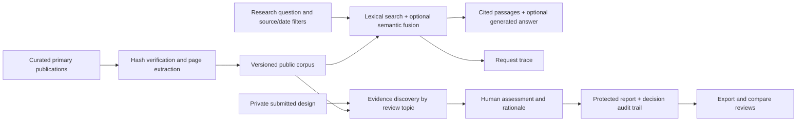

# EvidenceTrace

**An AI governance and security evidence workspace.** Research primary guidance,
inspect exact passages, review a system design, and record decisions with an audit
trail. It retrieves published knowledge; it does not train a foundation model.

**Deployment status:** the [public AWS research workspace](https://7sg5kts66a.execute-api.us-east-2.amazonaws.com/default/)
runs v0.2. It exposes the versioned public corpus and source-record views; private
design reviews and request traces remain intentionally unavailable on Lambda,
whose `/tmp` storage is ephemeral.

## Try the workspace

```bash
python -m venv .venv
# Windows: .venv\Scripts\activate
# macOS/Linux: source .venv/bin/activate
pip install -c constraints-tested.txt ".[dev]"
python scripts/build_corpus.py
python scripts/serve_workspace.py
```

Open **http://127.0.0.1:8765/**. The launcher binds to loopback and allows local
operator access. No API key is needed for research or evidence reviews. To enable
generation, explicitly set environment variables from `.env.example`; plain Python
does not automatically load that file. Docker Compose loads it via `env_file`.

1. In **Research**, ask “What does OWASP say about excessive agency?”
2. Inspect the exact indexed passage and physical PDF page. Source filters and a
   publication-date cutoff make the scope explicit.
3. In **Design reviews**, load the sample support-assistant design. It intentionally
   contains both controls and gaps; it is not a real customer deployment.
4. Run a review, inspect suggested guidance alongside candidate document passages,
   and record a decision with your rationale.
5. Export Markdown/JSON, revise the design, and compare two saved reviews.
6. Inspect source hashes and editions in **Source library**.

## Source coverage

The pinned snapshot has **7 publications, 497 physical PDF pages, and 2,264 chunks**.
Page totals include covers and section dividers; extraction diagnostics identify
pages with little text. These are selected editions, not a claim that every source
is the latest available publication.

| Publication | Pages | Coverage |
| --- | ---: | --- |
| NIST AI RMF 1.0 | 48 | AI governance and risk management |
| NIST Generative AI Profile | 64 | Generative-AI risks and suggested actions |
| NIST AI RMF Playbook snapshot | 147 | Operational actions and documentation |
| OWASP LLM Top 10, 2025 edition | 45 | Application security and abuse risks |
| NIST Adversarial ML taxonomy, 2025 | 127 | Attacks, mitigations, and limitations |
| NIST SP 800-218A | 30 | Secure development practices for AI models |
| NIST SP 800-218, SSDF 1.1 | 36 | Supporting secure software development practices |

URLs, hashes, source aliases, and publisher metadata are in
[`data/corpus_manifest.json`](data/corpus_manifest.json). Downloads are hash-pinned;
unexpected publisher changes fail the build. Hash-named PDFs/extractions remain
local and are not committed. Existing raw snapshots are preserved. Undated sources
are excluded from dated queries instead of being assigned an invented date.

## What is implemented

| Layer | Implementation |
| --- | --- |
| Ingestion | Reproducible PDF downloads; SHA-256 checks; physical-page extraction; rotated-text fallback; bounded chunks; idempotent version identity |
| Research | FTS5/BM25 candidates, catalog-driven source-name routing, title ranking, source/page diversity, optional semantic RRF |
| Provenance | Source editions, publication dates, fingerprints, snapshot comparisons, exact passage views |
| Design review | Eight explicit topics; candidate internal passages plus retrieved guidance; missing-evidence states; no automatic compliance decisions |
| Human decisions | Protected reports; rationale; optimistic concurrency; append-only decision events; report comparison |
| Generation | Optional OpenAI or Gemini; provider timeout/fallback; rejection of unknown citation labels; operator-only model calls |
| Privacy | Submitted documents never enter public retrieval; full submissions are not persisted; retained excerpts stay behind operator authorization |
| Operations | Health/capability endpoint, bounded requests, per-process throttling, Docker persistent-volume configuration, CI gates, sanitized Lambda packaging |

## Architecture and important boundaries



A matching phrase is not proof of a control: “rate limits are planned” is a
candidate requiring review, never automatically “documented.” Discovery is a
transparent lexical method with caution flags, not a semantic compliance judge.
The topic mappings are project-authored and require applicability review.

Citation-reference checks establish that a label exists in retrieved context.
They do **not** establish that every generated claim is supported. The UI reports
retrieval-only mode when a provider is absent or a response fails reference checks.

This is a **single-operator** workspace. SQLite is durable only on persistent disk;
Docker mounts `./data`. It is not a multi-tenant SaaS. Before an Internet-facing
private-review deployment, add tenant-aware identity, a shared rate limiter,
backup/retention operations, monitoring, and independent security validation.

## Evaluation

```bash
python -m pytest -q
python scripts/quality_gate.py
python scripts/quality_gate.py --suite evals/security_golden_set.json
python scripts/release_report.py
```

On environments with unrelated pytest plugins, set `PYTEST_DISABLE_PLUGIN_AUTOLOAD=1`.
Tests use temporary databases and fake keys; they do not need downloads or provider
calls. CI builds the real pinned corpus and runs both quality gates separately.

There are **49 development/regression questions**: the existing 28-case NIST suite
and a 21-case expansion. They measure source hit-rate, reciprocal rank, exact-page
hits where labeled, abstention, and local retrieval latency. These are not held-out,
independent expert evaluations and are not generated-answer accuracy measurements.
See [`reports/release-v0.2.json`](reports/release-v0.2.json) for every case and
[`docs/BENCHMARK_V2.md`](docs/BENCHMARK_V2.md) for interpretation and failure analysis.

Optional semantic comparison:

```bash
pip install ".[semantic]"
python scripts/compare_retrieval.py --weights 0.25 0.7
```

## Deployment

`docker compose up --build` binds the service to `127.0.0.1:8000`; set a strong
`EVIDENCETRACE_OPERATOR_KEY` in the uncommitted `.env` and enter it in Operator access.
The browser keeps that key in memory only. The Docker image excludes local databases,
secrets, and review artifacts; the persistent data volume is mounted at runtime.

`python scripts/package_release.py` builds the Linux/Python-3.12 Lambda archive
used by the public deployment.
It exports only public documents/chunks into a fresh database, with no reviews,
decision events, traces, or secrets. Lambda's `/tmp` storage remains ephemeral, so
private review creation is disabled there. The command itself only builds an
artifact; it does not deploy resources or change the live site.

Gemini generation uses Google's documented OpenAI-compatible endpoint. Set
`GEMINI_API_KEY` and an available `GEMINI_MODEL`; alternatively set `OPENAI_API_KEY`
and `OPENAI_MODEL`. Provider charges/free quotas depend on your own account. Live
provider behavior must be tested with a configured account before advertising it.

## Attribution

NIST publications are attributed to the National Institute of Standards and
Technology. OWASP material is attributed to the OWASP GenAI Security Project; see
the linked publication for licensing and reuse terms. Source content and excerpts
retain their publishers' rights; this project claims no endorsement or official
crosswalk. All dates are source metadata, not determinations of legal applicability.

See [`docs/RELEASE_V2.md`](docs/RELEASE_V2.md) for engineering decisions, remaining
work, and a reproducible interview/demo walkthrough.
